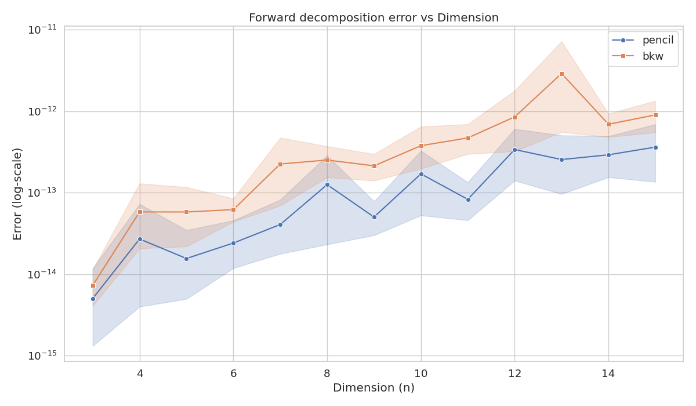
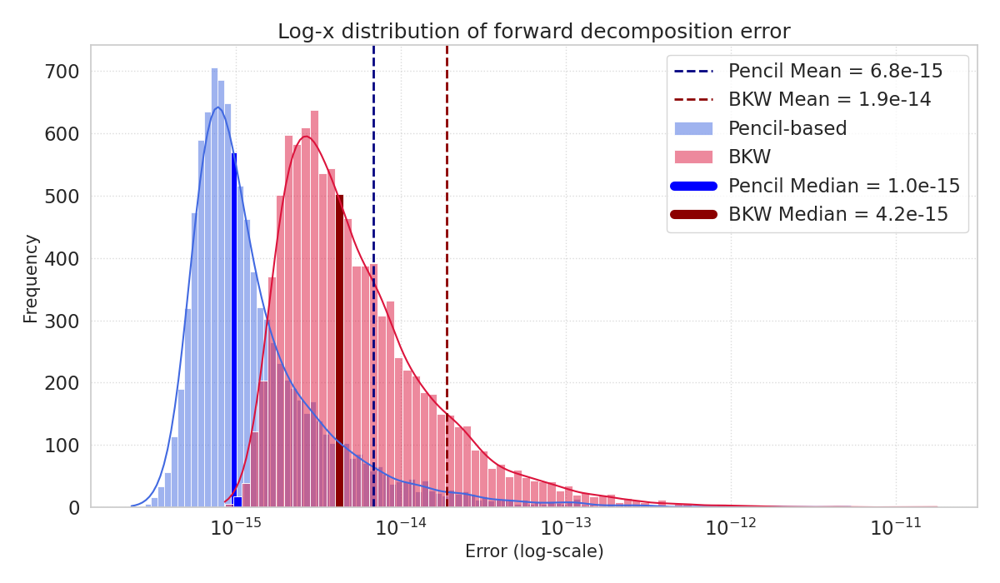
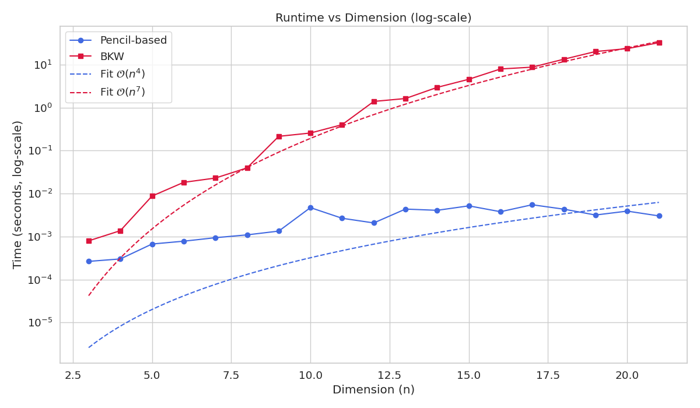
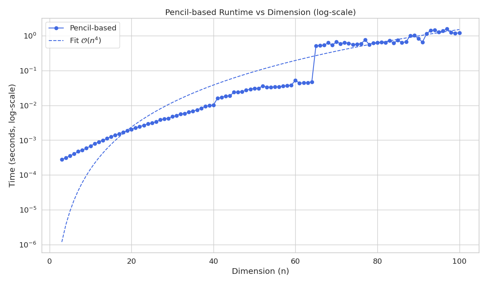

# Tensor CP Decomposition with BKW and Pencil-Based Algorithms

This project implements and compares two CP decomposition algorithms for cubic tensors:
- **BKW-based decomposition**: A Dleto algorithm based on ideas from Brooksbank, Kassabov, and Wilson.
- **Pencil-based decomposition**: A simpler, classical method based on generalized eigenvalue problems.

The **BKW algorithm** is a Dleto algorithm focused on finding minimal CP decompositions.  
This work was carried out as part of a bachelor's thesis at KU Leuven.

The main reference works for this project are:
- [Peter A. Brooksbank, Martin D. Kassabov, and James B. Wilson, *Detecting cluster patterns in tensor data*, 2024.](https://arxiv.org/abs/2408.17425)
- [Nick Vannieuwenhoven, *A chiseling algorithm for low-rank Grassmann decomposition of skew-symmetric tensors*, 2024.](https://arxiv.org/abs/2410.14486)

Special thanks goes out to Professor N. Vannieuwenhoven and D. Thorsteinsson for their supervision and guidance during the course of this thesis. We also gratefully acknowledge the open-source project [OpenDleto](https://github.com/thetensor-space/OpenDleto).

---

## Project Structure

```
bkw-algorithm/
    bkw.py
    find_derivative.py
    find_kernel.py
    find_eigenvalues.py

pencil-based-algorithm/
    pencil.py

plots/
    error_vs_dimension.py
    exp_library.py
    forward_error_distribution_bkw_vs_pencil.py
    time_bkw_vs_pencil.py
    time_pencil.py

images/
    dim_vs_error.png
    fout_verdeling.png
    time_pencil.png
    time_plot_both.png

library.py
README.md
```

---

## Algorithms

### BKW Algorithm

Use the following functions from `bkw.py` to work with the BKW decomposition:

- `bkw_decompose(tensor)`: Computes the BKW CP decomposition of a cubic tensor.
- `bkw_recompose(factors, factor_matrices)`: Reconstructs a tensor from the BKW decomposition output.

The input tensor must be cubic (n × n × n) with full multilinear rank and full rank.
---

### Pencil-Based Algorithm

Use the following functions from `pencil.py` to work with the pencil-based decomposition:

- `pencil_decompose(tensor)`: Computes the pencil-based CP decomposition of a cubic tensor.
- `pencil_recompose(factor_matrices)`: Reconstructs a tensor from the pencil decomposition output.

The input tensor must be cubic (n × n × n) with full multilinear rank.

---

## How to run the experiments

| Script | Purpose | Output Image |
|:---|:---|:---|
| `plots/error_vs_dimension.py` | Plots mean decomposition error vs tensor dimension (n). | `images/dim_vs_error.png` |
| `plots/forward_error_distribution_bkw_vs_pencil.py` | Plots the distribution of forward errors for 10⁴ tensors. | `images/fout_verdeling.png` |
| `plots/time_bkw_vs_pencil.py` | Plots runtime vs dimension (both BKW and pencil). | `images/time_plot_both.png` |
| `plots/time_pencil.py` | Plots runtime vs dimension for pencil only. | `images/time_pencil.png` |

To run an experiment:
```bash
python plots/<script_name>.py
```
---
## Results

### Error vs Dimension

Experiment: `plots/error_vs_dimension.py`



---

### Forward Error Distribution (BKW vs Pencil)

Experiment: `plots/forward_error_distribution_bkw_vs_pencil.py`



---

### Runtime vs Dimension (BKW and Pencil)

Experiment: `plots/time_bkw_vs_pencil.py`



---

### Runtime vs Dimension (Pencil Only)

Experiment: `plots/time_pencil.py`



---
### Pseudocode
Main algorithm: BKW

Step 1

Step 2

Step 3

Step 4

Step 5


---

## License

This project is provided for academic and research purposes.  
Please cite the referenced works if you use or build upon this work.
